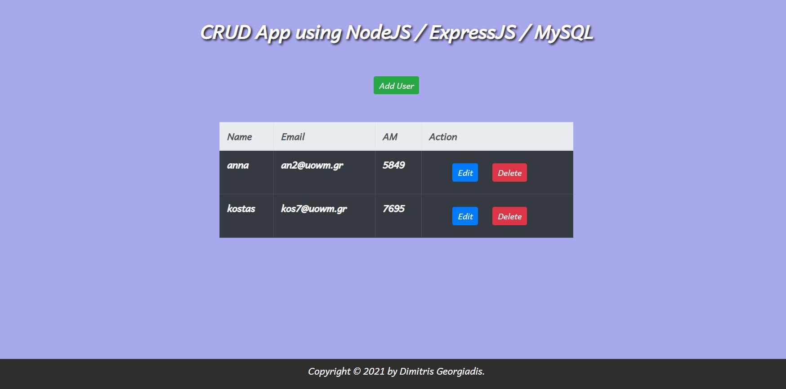

## To run it :


### in MySQL Workbench

```SQL
CREATE TABLE users (
    id INT UNSIGNED AUTO_INCREMENT PRIMARY KEY,
    name VARCHAR(30) NOT NULL,
    email VARCHAR(30) NOT NULL,
    am INT NOT NULL,
    reg_date TIMESTAMP DEFAULT CURRENT_TIMESTAMP ON UPDATE CURRENT_TIMESTAMP
);
INSERT INTO users(name, email, am)VALUES('anna','an2@uowm.gr',5849);

INSERT INTO users(name, email, am)VALUES('kostas','kos7@uowm.gr',7695);

INSERT INTO use(name, email, am)VALUES('alex','alw5@uowm.gr',2278);
```

### in terminal

```npm install```


```nodemon```


### go to http://localhost:3000/


